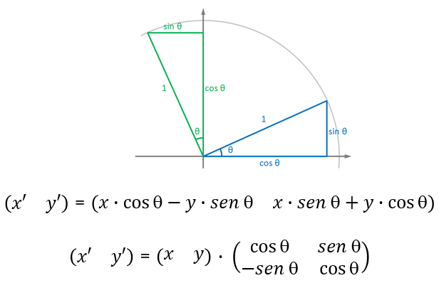

# Sistema Solar Interactivo con Three.js

## Tabla de Contenidos

- [Descripción](#descripción)
  - [Aspectos Destacados](#aspectos-destacados)
- [Características mostradas de los planetas](#características-mostradas-de-los-planetas)
  - [Características Visuales](#características-visuales)
  - [Interactividad](#interactividad)
  - [Panel GUI](#panel-gui)
- [Demo Visual](#demo-visual)
- [Estructura del Proyecto](#estructura-del-proyecto)
- [Uso](#uso)
  - [Navegación Básica](#navegación-básica)
  - [Crear Cometas](#crear-cometas)
- [Controles](#controles)
  - [Modo Órbita Por Defecto](#modo-órbita-por-defecto)
  - [Modo Vuelo Libre](#modo-vuelo-libre)
  - [Teclas Globales](#teclas-globales)
- [Documentación Técnica](#documentación-técnica)
  - [Tecnologías Utilizadas](#tecnologías-utilizadas)
  - [Dependencias](#dependencias)
- [Arquitectura del Código](#arquitectura-del-código)
  - [Componentes Principales](#componentes-principales)
- [Algoritmos Principales](#algoritmos-principales)
  - [Órbitas Elípticas: Desacoplamiento de Movimientos](#órbitas-elípticas-desacoplamiento-de-movimientos)
  - [Sistema de Lunas](#sistema-de-lunas)
  - [Seguimiento Suave de Cámara](#seguimiento-suave-de-cámara)
  - [Detección de Intersecciones](#detección-de-intersecciones)
  - [Proyección 3D de Cometas](#proyección-3d-de-cometas)
- [Texturas](#texturas)
  - [Fuentes Recomendadas](#fuentes-recomendadas)
- [Personalización](#personalización)
  - [Añadir un Nuevo Planeta](#añadir-un-nuevo-planeta)
  - [Modificar Velocidades Orbitales](#modificar-velocidades-orbitales)
  - [Cambiar Colores de Órbitas](#cambiar-colores-de-órbitas)
  - [Ajustar Iluminación](#ajustar-iluminación)
- [Volver arriba](#sistema-solar-interactivo-con-threejs)

---

## Descripción

Este proyecto es una **simulación interactiva del Sistema Solar** desarrollada con **Three.js**, una biblioteca de JavaScript para crear gráficos 3D en el navegador usando WebGL. La aplicación permite explorar nuestro sistema planetario con representaciones visuales, órbitas elípticas y múltiples modos de cámara.

### Aspectos Destacados

- **9 cuerpos celestes** modelados (Sol + 8 planetas)
- **Lunas** orbitando sus planetas
- **Anillos planetarios** para Saturno y Urano
- **Cometas dinámicos** que puedes crear
- **Panel de información** con datos reales y de simulación
- **Dos modos de control** de cámara
- **Fondo estelar** envolvente

---

## Características mostradas de los planetas 

| Planeta | Radio (km) | Distancia al Sol (M km) | Período Orbital |
|---------|-----------|------------------------|-----------------|
| Sol | 696,340 | Centro | — |
| Mercurio | 2,439 | 57.9 | 88 días |
| Venus | 6,051 | 108.2 | 225 días |
| Tierra | 6,371 | 149.6 | 365 días |
| Marte | 3,389 | 227.9 | 687 días |
| Júpiter | 69,911 | 778.5 | 12 años |
| Saturno | 58,232 | 1,434 | 29 años |
| Urano | 25,362 | 2,871 | 84 años |
| Neptuno | 24,622 | 4,495 | 165 años |

### Características Visuales

- **Texturas Realistas**: Cada planeta tiene texturas de alta calidad
- **Iluminación Dinámica**: Luz puntual desde el Sol con luz ambiental
- **Órbitas Elípticas**: Trayectorias visuales semi-transparentes
- **Rotación Planetaria**: Los planetas rotan sobre su propio eje
- **Anillos Planetarios**: Saturno y Urano con sus característicos anillos
- **Estrellas de Fondo**: Esfera envolvente con textura de galaxia

### Interactividad

- **Selección de Objetos**: Click en planetas, lunas o anillos
- **Seguimiento de Cámara**: La cámara sigue suavemente al objeto seleccionado
- **Creación de Cometas**: Doble click para crear cometas con trayectorias dinámicas
- **Panel de Información**: Datos del objeto seleccionado
- **Controles de Cámara**: Alterna entre modo órbita y modo vuelo libre

### Panel GUI

El panel de control incluye:

- **Modo de Control de Cámara**: Órbita vs. Vuelo Libre
- **Botón de Reset**: Vuelve a la vista normal
- **Información del Objeto**:
  - Nombre del cuerpo celeste
  - Datos reales (distancia, radio, período orbital)
  - Datos de la simulación (radio, distancia, velocidad en Three.js)

---

## Demo Visual

<video src="DEMO.mp4" controls width="100%"></video>

---

## Estructura del Proyecto

```
sistema-solar-threejs/
│
├── src/
│   ├── textures/          # Texturas de planetas y estrellas
│   │   ├── sun.jpg
│   │   ├── mercury.jpg
│   │   ├── venus.jpg
│   │   └── ...
│   ├── index.html         # Archivo HTML principal
│   └── index.js           # Código principal de la aplicación
│
├── package.json           # Dependencias del proyecto
├── README.md              # Este archivo
└── DEMO.mp4        
```

---

## Uso

### Navegación Básica

1. **Iniciar la aplicación**: Abre el navegador en la URL del servidor local
2. **Explorar**: Usa el ratón para rotar la cámara (modo órbita por defecto)
3. **Seleccionar**: Click en cualquier planeta para seguirlo
4. **Información**: El panel GUI muestra datos del objeto seleccionado
5. **Reset**: Presiona ESC o usa el botón "Volver a Vista Normal"

### Crear Cometas

1. Asegúrate de no estar siguiendo ningún planeta
2. Haz doble click en cualquier parte del espacio vacío
3. Se creará un cometa que viaja hacia el Sol
4. Los cometas tienen una cola de partículas y desaparecen automáticamente

---

## Controles

### Modo Órbita (Por Defecto)

| Acción | Control |
|--------|---------|
| Rotar Cámara | Click Izquierdo + Arrastrar |
| Zoom | Rueda del Ratón |
| Pan | Click Derecho + Arrastrar |
| Seleccionar Objeto | Click Izquierdo |
| Crear Cometa | Doble Click |

### Modo Vuelo Libre

| Acción | Control |
|--------|---------|
| Mirar Alrededor | Click + Arrastrar |
| Mover Adelante | W |
| Mover Atrás | S |
| Mover Izquierda | A |
| Mover Derecha | D |
| Subir | R |
| Bajar | F |
| Rotar | Q / E |

### Teclas Globales

| Tecla | Acción |
|-------|--------|
| ESC | Resetear vista y deseleccionar |

---

## Documentación Técnica

### Tecnologías Utilizadas

- **Three.js**: Biblioteca principal para renderizado 3D
- **lil-gui**: Panel de control interactivo
- **WebGL 2.0**: API gráfica de bajo nivel
- **ES6+ JavaScript**: Sintaxis moderna de JavaScript

### Dependencias

```json
{
  "name": "threejs-ig-eii",
  "version": "1.0.0",
  "description": "IG-EII",
  "main": "index.html",
  "scripts": {
    "start": "parcel ./src/index.html --open",
    "build": "parcel build ./src/index.html"
  },
  "dependencies": {
    "three": "0.152.1",
    "lil-gui": "0.20.0"
  },
  "devDependencies": {
    "parcel-bundler": "^1.6.1"
  },
  "keywords": [
    "threejs",
    "example",
    "basic"
  ]
}
```

---

## Arquitectura del Código

### Componentes Principales

#### 1. **Inicialización** (`init()`)
- Configura la escena Three.js
- Crea cámara y renderer
- Añade iluminación
- Genera planetas y lunas
- Configura eventos de usuario

#### 2. **Loop de Animación** (`animationLoop()`)
- Se ejecuta 60 veces por segundo
- Actualiza posiciones de planetas (órbitas elípticas)
- Actualiza rotaciones
- Mueve cometas
- Actualiza controles de cámara
- Renderiza la escena

#### 3. **Sistema de Objetos**

```
Scene
├── Galaxy (fondo estrellado)
├── Lights (ambiental + puntual)
├── Sun (estrella)
├── Planets
│   ├── Mercury
│   ├── Venus
│   ├── Earth
│   │   └── Moon (hijo de Earth)
│   ├── Mars
│   ├── Jupiter
│   ├── Saturn
│   │   └── Rings (hijo de Saturn)
│   ├── Uranus
│   │   └── Rings (hijo de Uranus)
│   └── Neptune
└── Comets (dinámicos)
```

---

## Algoritmos Principales

### Órbitas Elípticas: Desacoplamiento de Movimientos

#### El Problema Inicial

En una implementación naive usando el grafo de escena de Three.js, si añades un planeta como hijo de la estrella y usas rotaciones, el planeta heredaría automáticamente la rotación de la estrella. Esto crea un **acoplamiento no deseado**: cuando la estrella rota, arrastra a todos sus planetas.

#### La Solución: Cálculo Manual de Posiciones

Para desligar completamente el movimiento orbital de los planetas de cualquier rotación de la estrella, se calculan las posiciones de forma explícita usando trigonometría, en lugar de confiar en las transformaciones jerárquicas de Three.js.

#### Fundamento Matemático

La rotación 2D de un punto alrededor del origen se define mediante la matriz de rotación:



*Rotación 2D: transformación de coordenadas*

```
(x', y') = (x · cos θ - y · sen θ,  x · sen θ + y · cos θ)
```

En forma matricial:

```
[ x' ]   [ cos θ  -sen θ ] [ x ]
[ y' ] = [ sen θ   cos θ ] [ y ]
```

Aplicado a órbitas circulares:

```
x(t) = cos(θ) · dist
y(t) = sen(θ) · dist
```

**Variables globales del código:**

```javascript
let t0 = 0;              // Tiempo inicial (timestamp) para calcular animaciones
let accglobal = 0.0003;  // Aceleración global que controla la velocidad de las órbitas
let timestamp;           // Tiempo transcurrido usado en el loop de animación
let Planetas = [];       // Array que almacena todos los planetas
```

**Función de creación de planeta (extracto relevante):**

```javascript
function Planeta(radio, dist, vel, texturePath, f1, f2, name) {
  const geom = new THREE.SphereGeometry(radio * 4, 32, 32);
  const texture = textureLoader.load(texturePath);
  const mat = new THREE.MeshStandardMaterial({
    map: texture,
    roughness: 1,
    metalness: 0,
    emissive: 0x111111,
    emissiveIntensity: 0.4
  });
  
  const planeta = new THREE.Mesh(geom, mat);
  planeta.userData = {
    dist,
    speed: vel,
    f1,
    f2,
    name,
    radius: radio * 4,
    initialAngle: Math.random() * Math.PI * 2
  };
  
  Planetas.push(planeta);
  scene.add(planeta);
  
  // Crear órbita visual
  const curve = new THREE.EllipseCurve(0, 0, dist * f1, dist * f2);
  const points = curve.getPoints(200);
  const geome = new THREE.BufferGeometry().setFromPoints(points);
  const mate = new THREE.LineBasicMaterial({
    color: 0x3399ff,
    opacity: 0.35,
    transparent: true
  });
  const orbita = new THREE.Line(geome, mate);
  orbita.rotation.x = Math.PI / 2;
  scene.add(orbita);
  
  return planeta;
}
```

**Actualización de posiciones en el loop de animación:**

```javascript
function animationLoop() {
  timestamp = (Date.now() - t0) * accglobal;
  
  requestAnimationFrame(animationLoop);

  // ----- ACTUALIZACIÓN DE PLANETAS -----
  for (let o of Planetas) {
    const angle = timestamp * o.userData.speed + o.userData.initialAngle;
    
    o.position.x = Math.cos(angle) * o.userData.f1 * o.userData.dist;
    o.position.z = Math.sin(angle) * o.userData.f2 * o.userData.dist;
    
    o.rotation.y += 0.01;
  }
  
  // ... resto del código de animación ...
  
  renderer.render(scene, camera);
}
```

#### Órbitas Elípticas

Para simular órbitas elípticas (más realistas), se introducen los factores **f1** y **f2**:

```javascript
x(t) = cos(θ) · dist · f1
y(t) = sen(θ) · dist · f2
```

- Si **f1 = f2 = 1.0** → Órbita circular perfecta
- Si **f1 ≠ f2** → Órbita elíptica (ej: f1=1.0, f2=0.8)

**Ejemplo de configuración en init():**

```javascript
Estrella(10, "src/textures/sun.jpg");

Planeta(0.4, 30.0, 4.15, "src/textures/mercury.jpg", 1.0, 0.85, 'Mercurio');
Planeta(0.9, 50.0, 1.62, "src/textures/venus.jpg", 1.0, 0.9, 'Venus');
let tierra = Planeta(1.0, 70.0, 1.0, "src/textures/earth.jpg", 1.0, 0.88, 'Tierra');
Planeta(0.5, 90.0, 0.53, "src/textures/mars.jpg", 1.0, 0.83, 'Marte');
Planeta(2.5, 130.0, 0.084, "src/textures/jupiter.jpg", 1.0, 0.87, 'Júpiter');

let saturno = Planeta(2.1, 170.0, 0.034, "src/textures/saturn.jpg", 1.0, 0.82, 'Saturno');
crearAnillos(saturno, 2.1 * 4, 1.2, 2.0, "src/textures/saturn_ring.jpg");

let urano = Planeta(1.8, 210.0, 0.0119, "src/textures/uranus.jpg", 1.0, 0.8, 'Urano');
crearAnillos(urano, 1.8 * 4, 1.5, 2.2, "src/textures/uranus_ring.jpg");

Planeta(1.7, 250.0, 0.006, "src/textures/neptune.jpg", 1.0, 0.78, 'Neptuno');

Luna(tierra, 0.27, 7.0, 9.0, "src/textures/moon.jpg", 0);
```

#### Visualización de las Órbitas

Código original para crear las trayectorias elípticas:

```javascript
const curve = new THREE.EllipseCurve(0, 0, dist * f1, dist * f2);
const points = curve.getPoints(200);

const geome = new THREE.BufferGeometry().setFromPoints(points);

const mate = new THREE.LineBasicMaterial({ 
  color: 0x3399ff,
  opacity: 0.35,
  transparent: true 
});

const orbita = new THREE.Line(geome, mate);
orbita.rotation.x = Math.PI / 2;
scene.add(orbita);
```

#### Gestión del Tiempo

El sistema usa un timestamp normalizado para sincronizar todos los movimientos:

```javascript
t0 = Date.now();

timestamp = (Date.now() - t0) * accglobal;
```

**Parámetros clave:**
- `t0`: Marca temporal de inicio de la simulación
- `accglobal`: Controla la velocidad de toda la simulación (mayor valor = más rápido)
- `userData.speed`: Velocidad orbital individual de cada planeta

### Sistema de Lunas

Las lunas utilizan el **grafo de escena jerárquico** de Three.js para heredar automáticamente el movimiento de su planeta padre.

#### Arquitectura de Jerarquía

```
Escena
└── Planeta
    └── Pivote (Object3D)
        └── Luna (Mesh)
```

#### Implementación Original

```javascript
function Luna(planeta, radio, dist, vel, texturePath, angle) {
  const pivote = new THREE.Object3D();
  pivote.rotation.x = angle;
  planeta.add(pivote);
  
  const geom = new THREE.SphereGeometry(radio * 3, 16, 16);
  const texture = textureLoader.load(texturePath);
  const mat = new THREE.MeshStandardMaterial({ 
    map: texture, 
    roughness: 1, 
    metalness: 0 
  });
  
  const luna = new THREE.Mesh(geom, mat);
  luna.userData = { 
    dist, 
    speed: vel, 
    name: `Luna de ${planeta.userData.name}`, 
    type: 'luna' 
  };
  Lunas.push(luna);
  pivote.add(luna);
}
```

**Actualización en el bucle de animación:**

```javascript
for (let o of Lunas) {
  o.position.x = Math.cos(timestamp * o.userData.speed) * o.userData.dist;
  o.position.z = Math.sin(timestamp * o.userData.speed) * o.userData.dist;
  o.rotation.y += 0.02;
}
```

### Seguimiento Suave de Cámara

Código original que implementa el seguimiento suave usando interpolación lineal:

```javascript
if (selectedPlanet) {
  const planetPos = new THREE.Vector3();
  selectedPlanet.getWorldPosition(planetPos);
  
  const offset = new THREE.Vector3(0, 15, 30);
  
  const cameraPos = planetPos.clone().add(offset);
  
  camera.position.lerp(cameraPos, 0.05);
  
  camera.lookAt(planetPos);
} else {
  if (params.controlMode === 'orbit') {
    controls.update();
  } else {
    controls.update(clock.getDelta());
  }
}
```

**Explicación del efecto:**
- `lerp(cameraPos, 0.05)` mueve la cámara 5% hacia el objetivo cada frame
- Esto crea un efecto de aceleración/desaceleración suave

### Detección de Intersecciones

El sistema usa **Raycasting** para detectar clics. Código original:

```javascript
function onMouseClick(event) {
  mouse.x = (event.clientX / window.innerWidth) * 2 - 1;
  mouse.y = -(event.clientY / window.innerHeight) * 2 + 1;
  
  raycaster.setFromCamera(mouse, camera);
  
  const intersects = raycaster.intersectObjects([...Planetas, ...Lunas, ...Anillos, estrella], true);
  
  if (intersects.length > 0) {
    selectedPlanet = intersects[0].object;
    showPlanetInfo(selectedPlanet);
  }
}
```

**Nota:** El parámetro `true` en `intersectObjects` permite detectar también objetos hijos (lunas, anillos).

### Proyección 3D de Cometas

Código original que convierte coordenadas 2D del ratón a posición 3D en el espacio:

```javascript
function onDoubleClick(event) {
  if (selectedPlanet) return;

  mouse.x = (event.clientX / window.innerWidth) * 2 - 1;
  mouse.y = -(event.clientY / window.innerHeight) * 2 + 1;
  raycaster.setFromCamera(mouse, camera);

  const intersects = raycaster.intersectObjects([...Planetas, ...Lunas, ...Anillos, estrella], true);
  if (intersects.length > 0) return;

  const distance = 200;
  
  const direction = new THREE.Vector3(mouse.x, mouse.y, 0.5);
  
  direction.unproject(camera);
  
  direction.sub(camera.position).normalize();
  
  const startPos = camera.position.clone().add(direction.multiplyScalar(distance));

  crearCometa(startPos);
}
```

---

## Texturas

### Fuentes Recomendadas

Las texturas pueden obtenerse de:

- **[Solar System Scope](https://www.solarsystemscope.com/textures/)** (gratuitas)
- **[NASA](https://www.nasa.gov/multimedia/imagegallery/)** (dominio público)
- **[Planet Pixel Emporium](http://planetpixelemporium.com/planets.html)** (uso educativo)

---

## Personalización

### Añadir un Nuevo Planeta

```javascript
Planeta(
  1.5,
  180.0,
  0.05,
  "src/textures/mi_planeta.jpg",
  1.0,
  0.95,
  'Mi Planeta'
);
```

### Modificar Velocidades Orbitales

```javascript
let accglobal = 0.0003;
```

### Cambiar Colores de Órbitas

```javascript
const mate = new THREE.LineBasicMaterial({ 
  color: 0xFF0000,
  opacity: 0.5,
  transparent: true
});
```

### Ajustar Iluminación

```javascript
const ambientLight = new THREE.AmbientLight(0x404040, 0.8);

const sunLight = new THREE.PointLight(0xffffff, 3, 5000);
```

---

[Volver arriba](#sistema-solar-interactivo-con-threejs)
